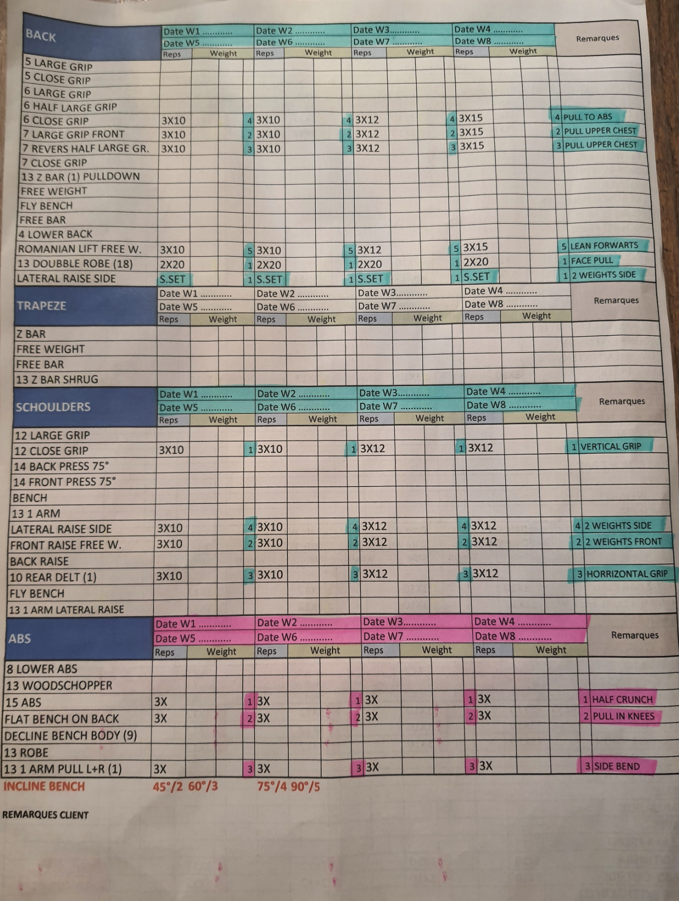

# Fitness Tracker

A mobile-first PWA that replaces a paper + Excel gym routine with a tap-friendly workout tracker.

## Demo

<video src="./demo.mp4" controls muted playsinline width="380"></video>

> If the video doesn't play inline, [download demo.mp4](./demo.mp4).

## Before → After

| Before — Excel sheet | After — the app |
|---|---|
|  |  |

## Situation

I tracked 82 gym exercises across 9 muscle groups in a hand-maintained Excel sheet, logged with pen and paper — not even on a phone. Finding last week's weights meant scanning dense rows by eye; understanding the sheet required remembering what every abbreviation meant. Slow to search, harder to share, and no way to see progress at a glance.

## Task

Build a mobile-first app that keeps the Excel mental model (Day 1, Day 2, auto-numbered slots like `Chest1`, `Chest2`) but makes logging a set a one-tap action and scheduling weeks a drag-and-drop gesture.

## Action

Designed and built a React PWA with a three-layer data model — Library → Workouts/Days → Weekly Plans — and a gym-friendly UI:

- **82-exercise library** seeded from the original Excel, filterable by an interactive SVG body map and equipment type.
- **Auto slot numbering** (`Chest1`, `Chest2`) computed at render time from insertion order.
- **Set editor** with steppers tuned for gym use: ±1 rep, ±2.5 kg, ±15 s rest.
- **Weekly plans** with independent set logs per week copy, enabling progressive-overload tracking.
- **Drag-and-drop** reordering via @dnd-kit; localStorage persistence; dark theme with Bebas Neue + DM Sans.

**Stack:** React 18 · Tailwind CSS · @dnd-kit · lucide-react · CRA.

## Result

- Logging a set: from ~20 s in Excel to ~2 s in the app.
- Zero context-switching between tabs to see last week's weights.


**Next:** per-exercise demo videos — users will record their own form clips and play them inline in the set editor.

## Screens

| Workout detail | Select exercises | Set editor | Week plans |
|---|---|---|---|
|  |  |  |  |

## Run locally

```bash
cd my-app
npm install
npm start
```

Opens at `http://localhost:3003`. Best viewed at mobile width (≤430 px). Full spec and roadmap in [CLAUDE.md](./CLAUDE.md).
